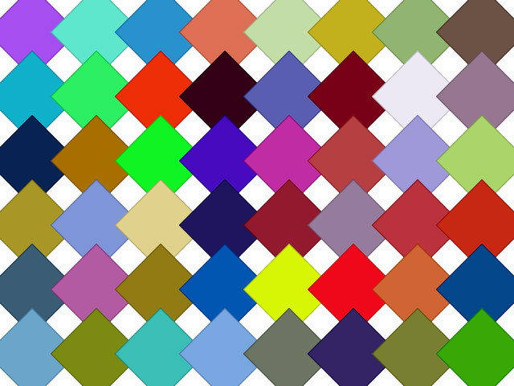

# easy-tiler

**easy-tiler** is a Python library for creating images of patterns made of tiles on a grid. It leverages [Pycairo](https://pycairo.readthedocs.io/) to produce high-quality PNG and SVG outputs.

Whether you're looking to generate geometric art, architectural patterns, or simple tiling textures, `easy-tiler` provides a flexible API and CLI to configure tile shapes, colors, and grid geometry.

## Examples

### Polygon Tiles

```python
from easy_tiler.io import save_png, save_svg
from easy_tiler.factories import make_tile_factory
from easy_tiler.grid import Grid

# Define a 8x6 grid with 80x80px cells
grid = Grid(8, 6, x_size=80, y_size=80)

# Create a factory for polygon tiles (default is a square)
factory = make_tile_factory(tile_type='polygon', bg='white', fg='random', sides=4, outline=False)

# Save as PNG and SVG
save_png('output.png', grid, factory)
save_svg('output.svg', grid, factory)
```

This would produce an image of 8x6 squares with random colors, similar to the image below.



## Key Features

- **Multiple Tile Types**: Support for regular polygons (triangles, squares, etc.), Truchet tiles, Riley tiles, and Puck (circle-based) tiles.
- **Configurable Grids**: Define grid size, cell size, and origin.
- **Advanced Geometry**: Apply skew angles (shear) and shifts to create dynamic and complex tiling patterns.
- **Pycairo Backend**: High-performance rendering with support for transparency and vector/raster export.
- **CLI Tool**: Early-stage CLI for quick experimentation.

## Installation

`easy-tiler` requires Python 3.13 or higher.

### Using `uv` (Recommended)

If you use [uv](https://github.com/astral-sh/uv), you can install the dependencies and the tool directly:

```bash
uv sync
```

### Manual Installation

You can install the dependencies manually using pip:

```bash
pip install pycairo pillow numpy
```

## Quick Start

### Python API

Here is a simple example to render a grid of squares:

```python
from easy_tiler.io import save_png, save_svg
from easy_tiler.factories import make_tile_factory
from easy_tiler.grid import Grid

# Define a 10x10 grid with 80x80px cells
grid = Grid(10, 10, x_size=80, y_size=80)

# Create a factory for polygon tiles (default is a square)
factory = make_tile_factory(tile_type='polygon', bg='white', fg='black', sides=4, outline=False)

# Save as PNG and SVG
save_png('output.png', grid, factory)
save_svg('output.svg', grid, factory)
```

### CLI Usage

You can run the CLI entry point directly:

```bash
python -m easy_tiler
```

Or, if installed:

```bash
easy-tiler
```

## Development

- **Build system**: Uses `uv_build`.
- **Linting & Formatting**: Uses `Ruff`.
- **Testing**: Uses `pytest`.

To run tests:
```bash
pytest
```

## License

This project is authored by Joseph Barraud. See `pyproject.toml` for metadata.
